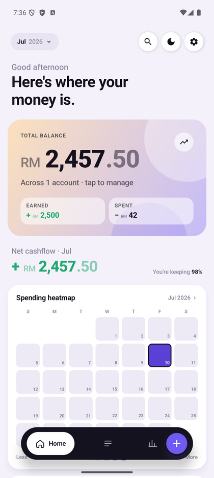
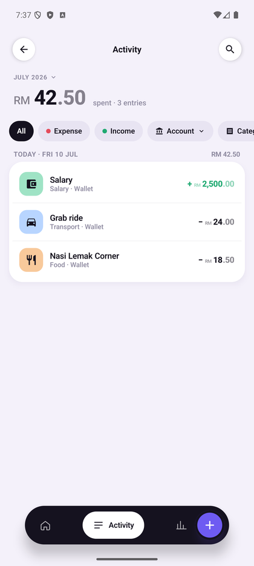
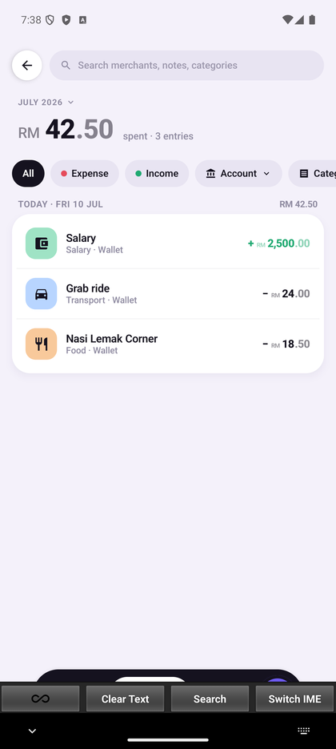

# SpendWise

**A fast, private, offline-first expense tracker for Android.**

SpendWise keeps your entire financial ledger on your device — no account, no
cloud service, no analytics. Log expenses in seconds, see where your money
goes, and let automatic daily backups keep your data safe.

[](https://github.com/wansiong50-pixel/spendwise/releases)
[](LICENSE)


| Home | Activity | Settings & backups |
|:---:|:---:|:---:|
|  |  |  |

## Features

- **Quick entry** — amount, category, merchant, done. Merchant names are
  auto-canonicalized so "grab", "Grab" and "GRAB " all become one merchant.
- **Dashboard** — total balance across accounts, monthly cashflow, and a
  spending heatmap calendar.
- **Activity** — month-scoped transaction list with search, account and
  category filters.
- **Insights** — yearly trends, category breakdowns, and spending analysis.
- **Budgets** — set a monthly limit per category and track progress.
- **Multiple accounts** — cash, bank, credit; archive retired accounts
  without losing history.
- **Automatic daily backups** — a background job writes a dated JSON backup
  to a folder you choose. Point it at a cloud-synced folder (Drive,
  OneDrive…) and your data leaves the phone automatically. Keeps the newest
  7, prunes the rest.
- **Manual backup / restore & CSV export** — portable JSON backups and
  per-year CSV export for spreadsheets.
- **Dark mode**, fast cold start, smooth on low-end devices.

## Privacy

Your data never leaves your device unless *you* put it somewhere: all
storage is a local database, and backups go only to the folder you pick.
There are no accounts, no ads, no trackers, and no data collection.

## Download

Grab the latest APK from the [Releases page](https://github.com/wansiong50-pixel/spendwise/releases)
and install it (you may need to allow installs from unknown sources).

Requires Android 8.0 (API 26) or newer.

## Build from source

Requirements: JDK 17, Android SDK (compileSdk 36). Either open the project
in Android Studio, or use the Gradle wrapper:

```bash
./gradlew :app:testDebugUnitTest   # run unit tests
./gradlew :app:assembleDebug       # build a debug APK
```

The debug APK lands in `app/build/outputs/apk/debug/`.

### Release builds

Signed release builds read credentials from an untracked
`keystore.properties` at the repo root:

```properties
storeFile=/absolute/path/to/your.jks
storePassword=...
keyAlias=...
keyPassword=...
```

Without that file, `assembleRelease` still works but produces an unsigned
APK.

## Architecture

Single-module Kotlin app, plain and dependency-light:

- **UI** — Jetpack Compose (Material 3), single-activity, custom design
  system in `ui/theme/`.
- **Data** — Room (SQLite) with month/year-scoped reactive queries, so
  memory stays flat as the ledger grows. Preferences via DataStore.
- **DI** — manual, via `AppContainer` (no Hilt/Koin).
- **Background work** — WorkManager for the daily auto-backup job.
- **Domain logic** — pure Kotlin in `domain/`, `analytics/` and `backup/`,
  covered by JVM unit tests.

Money is stored as integer cents (`Long`); currency is Malaysian Ringgit
(RM) and dates use the `Asia/Kuala_Lumpur` timezone.

## Contributing

Issues and pull requests are welcome — see [CONTRIBUTING.md](CONTRIBUTING.md).

## License

[MIT](LICENSE)
